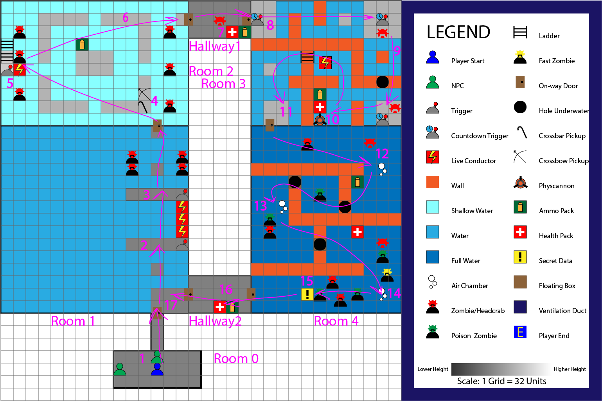
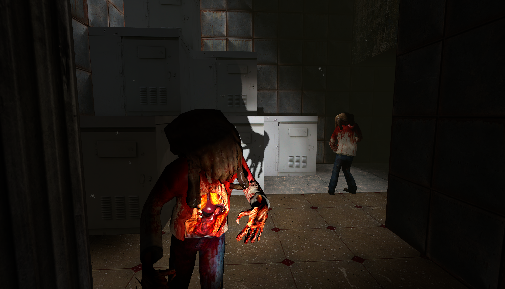
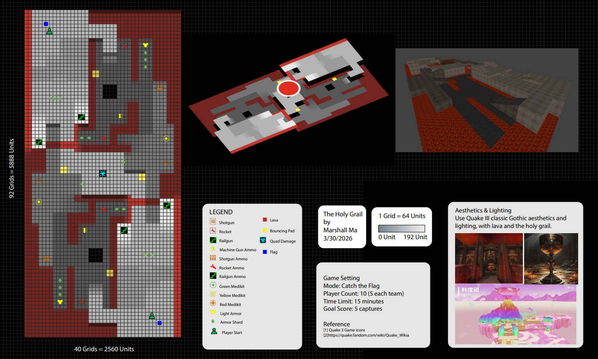
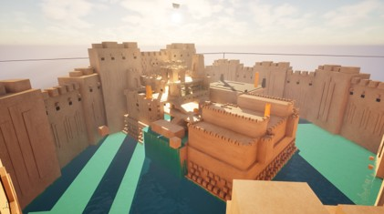
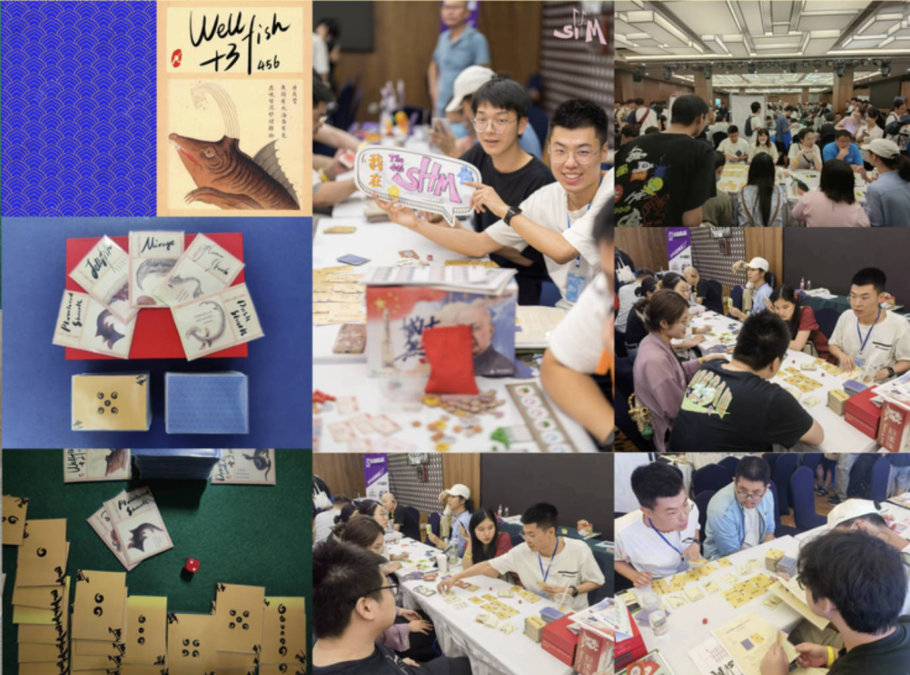

这里收录了四个核心案例之外的项目，重点展示我在 FPS 关卡、设计研究、快速原型与独立创作方面的能力。项目按照与关卡策划岗位的相关性排列。

## The Way of Water｜《半条命 2》单人关卡

项目类型｜负责内容｜工具｜核心机制
FPS 单人关卡｜关卡设计 / Gameplay 实现｜Hammer Editor｜水体物理 / 电力系统

我围绕《半条命 2》的水体物理与电力系统设计了一段完整的单人 FPS 流程：玩家深入发生事故的水下设施，在“水体导电”的持续威胁下切断电源、改变水位并寻找逃生路线。关卡将战斗、解谜和空间状态变化整合在同一条推进链中，而不是把机制作为彼此独立的房间挑战。

设计重点包括利用窗户、灯光和敌人布置建立远期目标；通过断电前后的环境变化让玩家理解行动结果；并在潜水探索、室内交火和涨水逃生之间切换节奏。这个项目训练了我围绕引擎既有机制组织玩法、控制视线，以及用环境本身完成玩家引导的能力。

@[youtube](https://youtu.be/ljxY9222A-8 "《The Way of Water》完整流程演示")

[查看关卡设计文档（PDF）](pdfs/MaZ_HL2_LDD.pdf)
[查看 ReadMe（PDF）](pdfs/MaZ_HL2_Readme_GC_Lite.pdf)

## The Holy Grail｜《雷神之锤 3》CTF 多人地图

项目类型｜负责内容｜工具｜开发方式
竞技场 FPS / CTF｜布局 / 交战路线 / 资源配置｜Radiant｜单人

这是一张失败的《Quake III Arena》CTF 多人地图。在制作此图之前，我对 PvP 射击游戏的主要认知来自《喷射战士》（Splatoon），因此直接沿用了它的地图设计思路。然而，《喷射战士》的武器射程普遍较短，而《雷神之锤 3》的武器射程、移动速度与交战节奏完全不同，最终导致地图过于开阔、长视线缺少切割，Railgun 资源过多，部分坡道与通路也无法稳定支撑高速移动和交火。

在开始体验《守望先锋》等 FPS 游戏并重新分析多人地图后，我发现传统 FPS 有着截然不同的空间逻辑。为了避免形成贯穿地图的远距离射击通道，入口、墙体、转角和掩体需要持续切割视线，让玩家以更可控的角度进入交火。相比之下，《喷射战士》的地图可以更加开阔，因为较短的射程与涂地机制会自然限制交战范围。

这次失败让我认识到，FPS 关卡设计不能脱离具体游戏讨论。武器射程、移动方式、击杀时间与模式目标，会共同决定视线长度、掩体密度、路线宽度、资源位置和出生朝向。地图 PDF 中记录了我当时设计的 5v5 对称 CTF 布局、15 分钟对局、5 次夺旗目标，以及武器、弹药、护甲、医疗、跳板、岩浆与 Quad Damage 的完整配置。

[查看多人地图设计图（PDF）](pdfs/The_Holy_Grail_CTF_Map.pdf)

## 毕业设计研究｜主题可供性与认知地图构建

研究主题｜研究对象｜核心变量｜项目状态
关卡设计研究｜复杂室内环境｜主题可供性｜正在制作中

我的毕业设计研究主题为“A Study on the Influence of Thematic Affordances on Players’ Cognitive Map Construction”，研究主题可供性如何影响玩家理解复杂室内环境，并建立对整体空间的认知表征。

主题可供性指环境通过建筑设计、视觉主题、环境叙事、物件摆放与空间构成传达功能意义的能力。玩家无需依赖明确指令或 UI，也能够从环境本身推断空间的用途。研究从两个连续的认知层次展开：

• 功能可读性：玩家能否通过一致的主题物件、建筑特征与视觉线索识别空间功能，并形成稳定记忆。
• 认知地图构建：玩家能否将已识别的功能区域作为空间锚点，理解区域之间的位置、连接关系与整体组织结构。

研究计划使用 Starfield Creation Kit 制作由多个功能区域、走廊、楼梯、电梯与中央中庭组成的大型室内关卡，并通过玩家探索、空间重访和测试，验证玩家是否能够从局部功能识别逐步形成全局认知地图。最终目标是把“环境主题是否清晰”转化为可观察、可测试的关卡设计问题。

[查看 Thesis Topic Best Practices（PDF）](pdfs/Thesis_Topic_Best_Practices.pdf)

## Box Shot｜UE5 高速 FPS 团队项目

42 人团队开发的 UE5 高速 FPS 项目，目前仍在研发中。该项目将进一步扩展我在高速移动、战斗空间与大型跨职能团队协作方面的经验；在内容允许公开后，我会补充具体职责、关卡流程与测试迭代。

## Escape from the Circus｜Global Game Jam

项目类型｜职责｜工具｜周期
2D 平台跳跃 / 面部识别交互｜程序开发｜Unity｜48 小时

@[youtube](https://youtu.be/zzoBhNJkYKk "《Escape from the Circus》演示")

玩家通过面部动作控制角色完成平台跳跃。我负责程序开发，与团队在 48 小时内完成从交互概念、原型验证到可玩版本的完整流程。这次项目强化了我快速理解陌生输入方式、限定范围并交付可玩原型的能力。

[查看 Global Game Jam 项目页](https://globalgamejam.org/games/2024/escape-circus-2)

## OGO｜BOOOM Game Jam

我第一次参加 Game Jam 时使用 Unreal Engine 制作的 2D 平台跳跃游戏。项目让我初次经历在强时间限制下确定核心玩法、快速制作关卡并完成团队交付的全过程。

## 海错大爆钓｜原创卡牌桌游

项目类型｜职责｜项目状态
原创卡牌桌游｜独立游戏设计｜展出 / 出版合作推进中

我独立设计的原创卡牌桌游，曾于上海 SHM 桌游展及“中国好桌游”展出，目前正与出版社推进出版合作。这个长期项目让我在数字游戏之外持续训练规则设计、数值迭代、实体测试与面向真实玩家解释复杂系统的能力。
