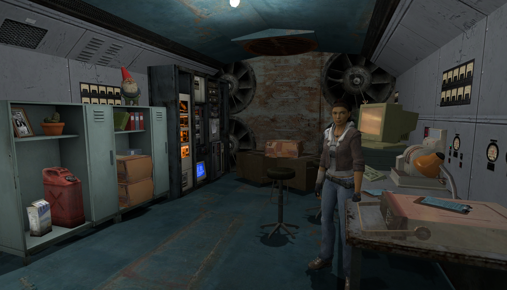

## Big Fishing Boom

An original card-based tabletop game exhibited at the Shanghai SHM Board Game Expo and the China Good Board Game showcase. I am currently working with a publisher toward publication.

## The Holy Grail

This was a failed Quake III Arena CTF multiplayer map. Before creating it, the only shooter I had seriously played was Splatoon. I assumed it represented the standard form of FPS design, so I carried many of its design principles into my own map. Because nearly every weapon in Splatoon has a very limited effective range, the resulting map was far too open.

After I began playing Overwatch, however, I discovered that traditional FPS games follow a very different design logic. Because their weapons are effective across much longer distances, their level design often feels counterintuitive: entrances are commonly placed directly beside walls, nearly every corner provides cover, and combat is shaped around narrow firing angles. Sightlines are repeatedly interrupted to prevent long firing lanes from spanning the map. As a result, FPS maps often feel winding and complex, almost like the streets of New York. Splatoon maps, by contrast, are generally more open, closer to real-world spaces, and more consistent with natural architectural layouts.

From this experience, I learned that FPS level design is shaped primarily by two factors:

• Engine choice: Engine technology determines how open a map can be. Compared with Bungie's latest engine, id Tech 3 is limited in geometric complexity and rendering distance. Maps built with id Tech 3 are therefore usually smaller and use techniques that minimize long sightlines to maintain high performance.
• FPS subgenre: The subgenre defines the experience a map must support. Extraction shooters, for example, emphasize lethality and often place players in spaces where they can be attacked from multiple angles. Arena shooters are fundamentally different: their encounters are carefully structured to create a sense of balance.

## The Way of Water

A Half-Life 2 single-player FPS level created in Hammer Editor. Combat and puzzle flow are built around water physics and electrical systems, with deliberate control of player guidance, combat pacing, and spatial sightlines.

## A Study on the Influence of Thematic Affordances on Players’ Cognitive Map Construction

My thesis investigates three layers of spatial cognition:

• Thematic Affordance: Whether players can recognize the function of a space through thematically distinctive environmental cues.
• Functional Zoning: Whether thematic environmental affordances help players distinguish functional areas and perceive clear transitions between them.
• Cognitive Map Construction: Whether players can use differentiated regions to construct a cognitive map of the overall environment.

## Box Shot

A high-speed UE5 FPS project developed by a 42-person team, currently in production.

## Escape from the Circus

@[youtube](https://youtu.be/zzoBhNJkYKk "Escape from the Circus Showcase")

A Global Game Jam Unity 2D platformer built around facial-recognition interaction. I served as a programmer, and the project was completed within 48 hours.

[Global Game Jam Project Page](https://globalgamejam.org/games/2024/escape-circus-2)

## OGO

A 2D platformer created in Unreal Engine for the BOOOM Game Jam. This was my first Game Jam project.

GCORES Link: OGO | GCORES
