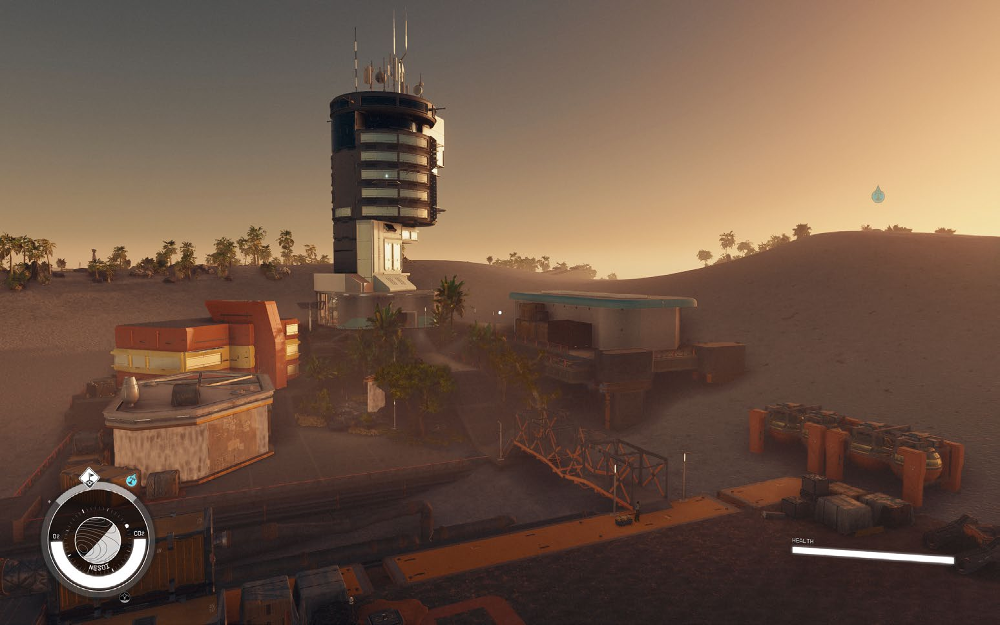
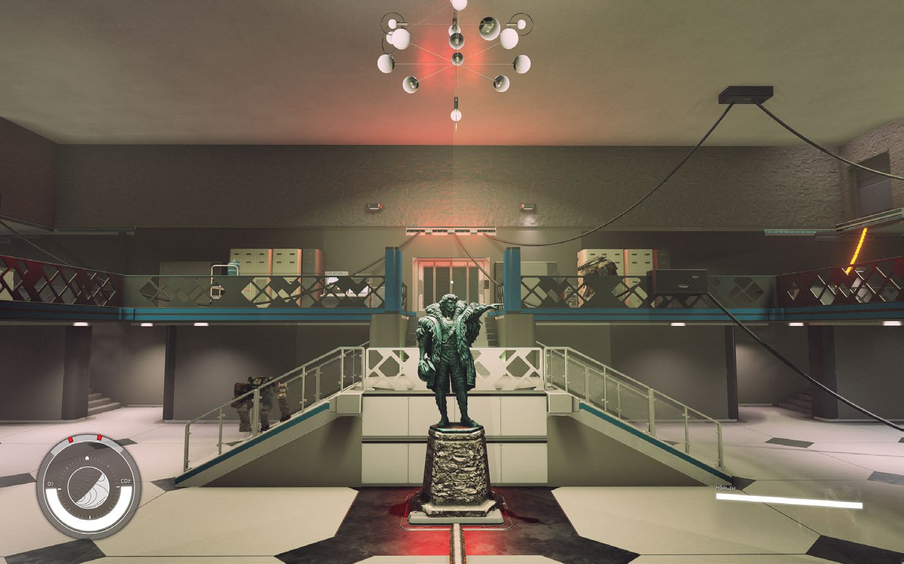
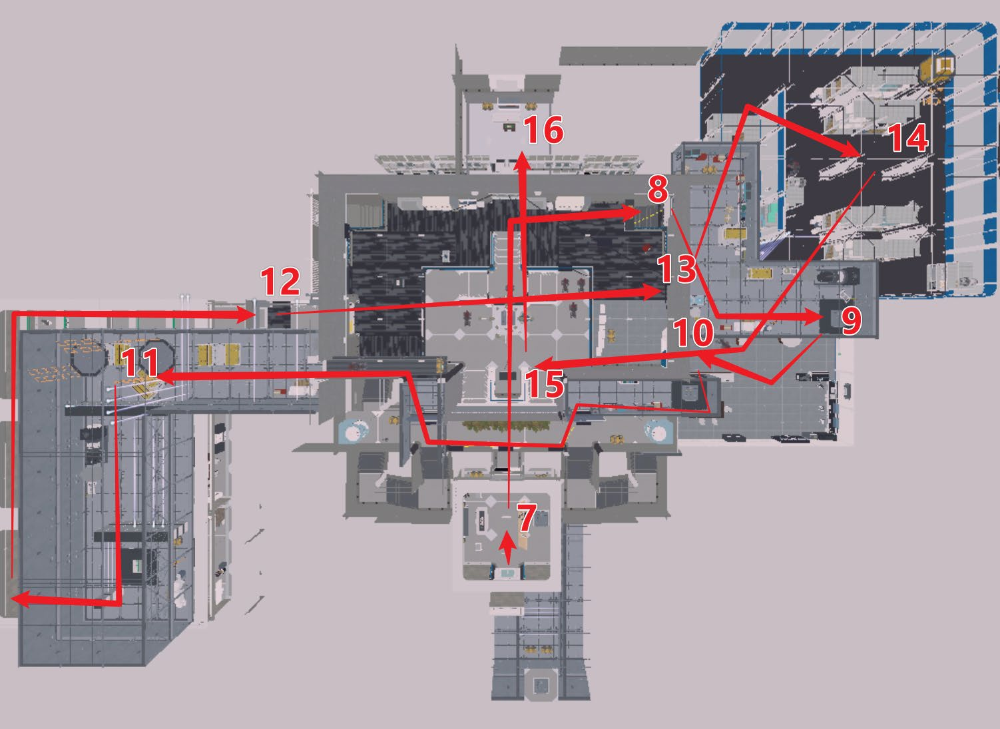
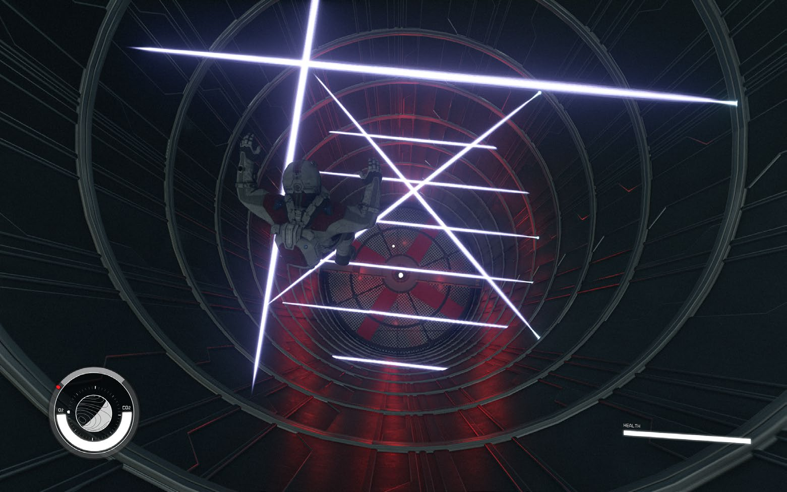
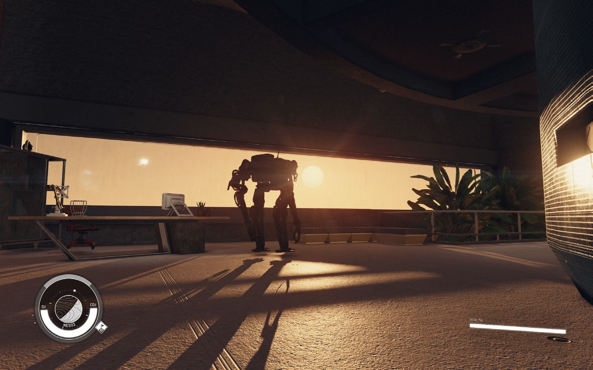
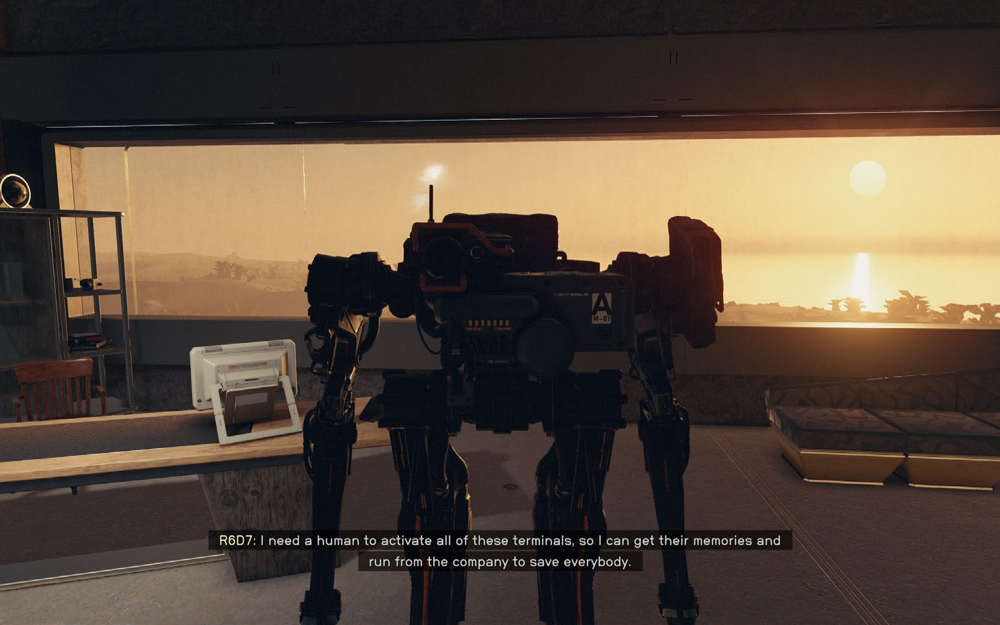

## 一句话简介

围绕中心枢纽、三阶段调查与道德抉择构建的《星空》原创支线任务；我使用 Creation Kit 独立完成约 18 分钟的室内外探索、战斗、谜题、对话与双结局流程。

## 项目概览

职责｜关卡设计 / 任务设计 / Gameplay 实现
开发｜10 周 / 单人 / 约 300 小时
规模｜4 个室外空间 / 7 个室内空间
流程｜约 18 分钟 / 双结局
工具｜Starfield Creation Kit / Papyrus

玩家受雇调查 Decaran III 自动化工厂的机器人暴动。进入工厂后，玩家通过不同功能区收集线索、激活三台终端并逐步解锁核心区域，最终发现向导机器人 R6D7 正是觉醒事件的推动者。玩家必须在恢复生产与释放机器人之间作出选择，并承担相应后果。

任务阶段｜玩家行动｜设计作用
建立悬念｜调查室外工业区并接触工人、医生、雇佣兵与 R6D7｜通过不同立场建立冲突背景
推进调查｜进入工厂，以中心大厅为枢纽探索三个分区｜交替组织探索、战斗、谜题与信息揭示
揭示真相｜乘电梯抵达屋顶办公室，得知 R6D7 的真实身份｜改变玩家对任务与同伴的理解
最终抉择｜返回中心大厅完成终战并决定工厂命运｜让前段角色关系与信息在结局汇合

@[youtube](lieJnrhMxWs "《Decaran: Become Human》完整游戏演示")

## 设计目标

1. 让玩家在复杂工厂中保留探索自由，同时始终理解当前目标与全局位置。
2. 让战斗、谜题、叙事信息与空间推进相互支撑，而不是彼此割裂。
3. 让最终选择同时包含收益与代价，避免简单的善恶二分。

## 01｜以中心大厅组织三阶段探索

工厂内部采用“中心大厅 + 三个任务分区”的枢纽结构。玩家首次进入大厅时就能看到锁定的中央电梯与三个状态指示器，从而提前理解长期目标；随后分别探索三个分区、完成战斗与终端交互，并多次返回大厅确认进度。

大厅并非单纯的通行空间：它同时承担导航锚点、进度反馈、战斗场地和最终对决舞台。反复经过同一空间时，敌人、任务状态和可进入路线持续变化，使空间重用成为任务节奏的一部分。

设计目标｜让玩家在非线性探索中维持方向感
实现方法｜可见的长期目标 / 中心枢纽 / 功能分区 / 循环返回
设计结果｜大厅由空旷通道转化为承担导航、进度、战斗与叙事的核心空间

## 02｜通过视线建立交互与结果的因果关系

初版中，玩家需要启动三台终端解锁中央电梯，但终端与电梯在视觉上相互隔绝。玩家完成交互后只能依赖任务文字判断进度，难以理解自己的操作究竟改变了什么。

我调整终端朝向并在交互区域增加观察窗，让玩家按下按钮时能够直接看到电梯对应的指示灯与门锁状态发生变化；同时使用电缆连接终端与目标装置，建立清晰的视觉因果关系。这次迭代把依赖文字提示的任务反馈，转化为玩家可以从环境中直接观察和理解的空间反馈。

## 03｜用空间与敌人组合建立战斗递进

我通过近战突击机器人与远程机器人形成互补威胁，并让遭遇空间从紧凑房间、开放大厅逐步扩展到垂直区域。玩家需要根据视距、高低差、掩体和目标优先级持续调整站位，而不是用同一种策略重复清场。

EMP 步枪 Novablast 为战斗提供了暂时瘫痪机器人的控制手段。前段遭遇用于让玩家理解失能机制，中段将近远程敌人组合在双层空间中，最终战则重用玩家已经熟悉的中心大厅，综合检验移动、目标选择与空间认知。

阶段｜空间与敌人｜玩家决策
前段教学｜紧凑房间 / 单一威胁｜理解 EMP 失能机制并建立基础战斗规则
中段组合｜双层大厅 / 近战 + 远程机器人｜利用高低差与掩体判断目标优先级
最终战斗｜重用中心大厅 / R6D7 与机器人增援｜在熟悉空间中综合运用武器、移动与路线认知

## 04｜让最终选择改变角色与世界状态

我不希望“释放机器人”天然等同于正确答案，因此让两条分支都同时包含收益与代价。玩家在前段遇到的医生、工人、雇佣兵与机器人分别提供不同立场，使最终选择建立在任务过程中获得的信息和关系之上。

最终选择｜即时结果｜后续影响
消灭 R6D7，恢复生产｜机器人被镇压，工厂重新运转｜公司与雇佣兵关系改善，药品供应恢复，人类病患获救
释放觉醒机器人｜机器人获得自由，工厂停止生产｜公司与雇佣兵转为敌对，药品供应中断，人类病患死亡

## Gameplay 与任务实现

我使用 Creation Kit 完成空间搭建、敌人配置、任务目标、NPC 对话与关卡状态管理，并通过 Papyrus Script 和 Quest Stage 控制门锁、终端、敌对阵营、角色行为、终战触发及双结局结果。Alias 用于管理关键角色与任务对象，确保跨场景推进时任务状态保持一致。

实现模块｜具体内容
任务流程｜目标更新 / Quest Stage / 对话条件 / 双结局
空间状态｜门锁 / 电梯 / 三台终端 / 隐藏入口
角色与战斗｜NPC 行为 / 阵营敌对 / 战斗触发 / Boss 战
玩家反馈｜任务文本 / 指示灯 / 观察窗 / 电缆引导

## 测试迭代

测试发现｜设计判断｜修改｜验证结果
玩家启动终端后无法判断其作用｜交互对象与反馈目标缺少空间联系｜调整终端朝向并增加观察窗，使玩家直接看到电梯状态变化｜玩家无需依赖任务文字即可理解终端与电梯的关系
完整激光平台段要求精确空中控制，与《星空》的移动手感不匹配｜挑战主要来自操作限制，而非有意义的空间决策｜缩减平台跳跃内容，保留激光作为局部障碍与区域限制｜降低流程中断，同时保留垂直区域的视觉识别与移动变化
初版大厅体量较大，但主要承担通行功能｜高成本核心空间没有充分参与任务推进｜改为中心枢纽，使玩家多次返回并在终战中再次使用｜大厅同时承担导航、进度反馈、战斗和叙事功能

## 时间线

Level Design Pitch｜2026.02.20｜确定主题、核心玩法、剧情框架与开发方向
Level Design Document｜2026.02.26｜完成 LDD，明确流程、空间布局、任务结构与战斗设计
Whitebox｜2026.03.09｜完成白盒，验证空间布局、玩家流程与关卡节奏
Initial Gameplay｜2026.03.29｜实现核心玩法、任务脚本与战斗系统，形成完整可玩流程
Gameplay Complete｜2026.04.18｜完成全部关卡内容并持续优化导航、战斗与任务体验
Aesthetics｜2026.04.26｜完成场景美术、灯光与环境表现
RTM｜2026.05.03｜完成最终优化、Bug 修复与项目交付

## 项目总结

项目成果（What Went Well）
• 独立完成一条包含室内外探索、战斗、谜题、NPC 对话与双结局的约 18 分钟支线任务。
• 使用中心枢纽与三个功能分区组织任务流程，并通过空间反馈提升目标可读性。
• 使用 Creation Kit 与 Papyrus 落地完整任务状态、角色行为和结局分支。

优化方向（Even Better If）
• 室外区域承担的玩法功能少于室内区域，后续应在白盒阶段更早验证各区域的内容密度。
• 战斗难度与敌人组合验证不足，后续应增加战斗专项测试，而非只测试完整流程。
• 初期在与基础移动手感不完全匹配的平台段投入过多时间，后续应更早验证机制与角色控制的适配性。

项目收获（What I Learned）
• 任务关卡并不是空间、剧情和战斗的简单叠加；目标、路线、信息与系统反馈必须共同服务于玩家当前的理解和决策。相比增加更多内容，更重要的是让每个空间承担明确功能，并让玩家能够从环境本身读懂自己的行动及其后果。

## 附件

[📄 查看 LDD｜完整关卡设计文档](pdfs/MaZ_DecaranBecomeHuman_LDD.pdf)

[📄 查看 ReadMe｜运行与体验说明](pdfs/MaZ_DecaranBecomeHuman_ReadMe.pdf)

[📄 查看 Portfolio｜项目设计总结](pdfs/MaZ_SF_DecaranBecomeHuman_Portfolio.pdf)
