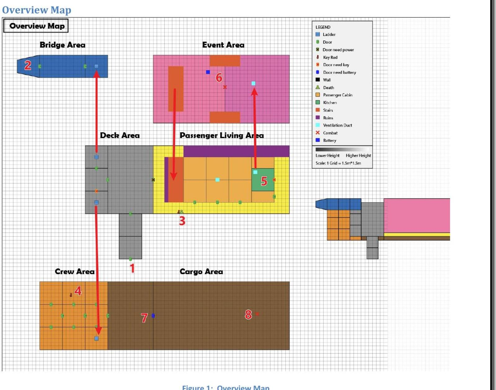
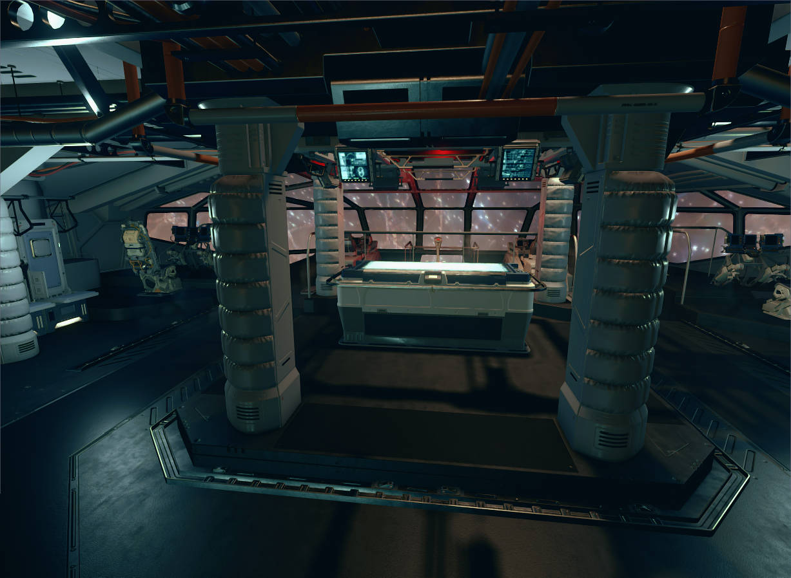
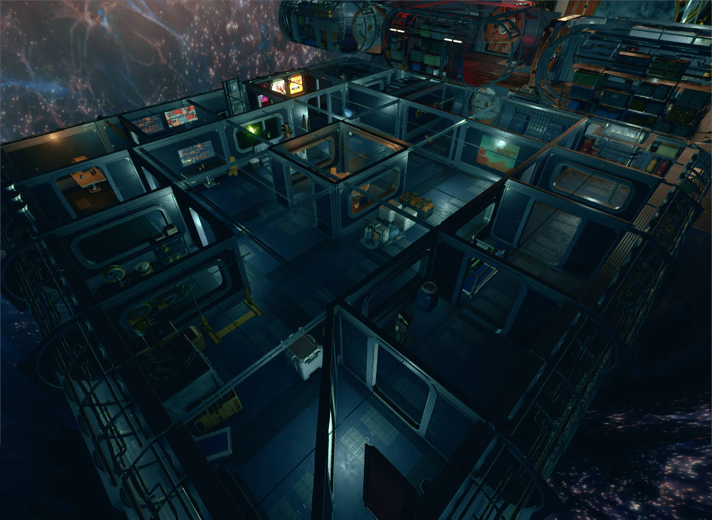
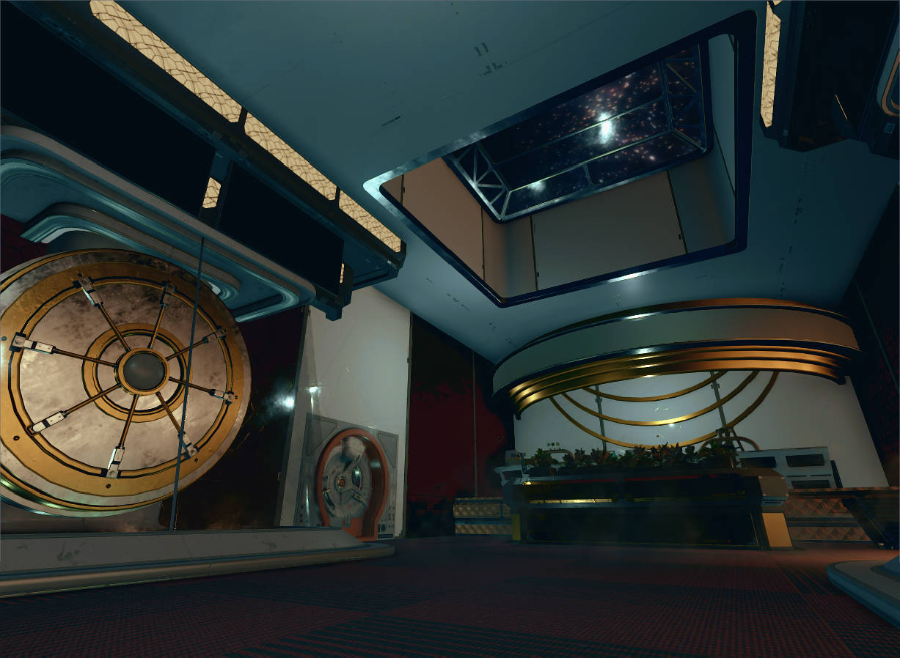

## One-Line Summary

A horror-exploration side quest built independently in the Starfield Creation Kit. The player boards a missing luxury space liner, restores power, searches for keys and batteries, crosses ventilation ducts, uncovers the disaster, and confronts the final threat in the cargo hold.

## Project Overview

Role｜Level Design / Environmental Storytelling / Gameplay Implementation
Development｜8 Weeks / Solo / Scrum
Structure｜6 Functional Zones / Approx. 16-Minute Target Playthrough
Gameplay｜Exploration / Puzzles / Stealth / Combat
Tools｜Starfield Creation Kit

I translated the functional layout of a real cruise ship into a third-person RPG level. Power-state changes, the contrast between luxurious upper decks and industrial lower decks, and a key-and-battery-driven loop create a complete arc from vulnerability and investigation to revealed danger and final confrontation.

Quest Phase｜Player Action｜Experience Goal
Establish Vulnerability｜Board the dark, zero-gravity main deck｜Limit information and control to establish uncertainty
Restore Order｜Reach the bridge and activate backup power｜Use gravity, lighting, and door changes as a moment of relief
Investigate｜Search passenger cabins, crew quarters, and the kitchen｜Reconstruct events through functional zones and environmental evidence
Escalate Threat｜Use the vents to enter the event area and collect three batteries｜Compress space, introduce enemies, and increase resource pressure
Final Confrontation｜Unlock the cargo hold, retrieve fuel, and fight the Terrormorph｜Release accumulated tension through combat

## Design Goals

1. Preserve fear without continuously stripping the player of agency, using limited counterplay instead.
2. Make every ship zone support spatial recognition, narrative information, and pacing rather than treating environmental storytelling as optional collectibles.
3. Use state changes, one-way shortcuts, and revisitation to create evolving play within a limited interior footprint.

## 01｜Building Horror Through Spatial State Changes

The level opens on a dark, zero-gravity main deck. The player relies on a flashlight to read the space and is directed by locked doors toward the bridge. Activating backup power restores gravity, lighting, and selected door access at once. A previously uncontrollable space becomes navigable, giving the player a brief sense of safety before the investigation expands.

Power restoration is not merely a quest checkbox. It changes movement, visibility, mood, and route availability simultaneously, allowing the player to feel that their action has reshaped the environment.

Design Goal｜Create a pacing turn through interaction rather than quest text alone
Method｜Dark zero-gravity opening / visible bridge objective / synchronized lighting, gravity, and door changes
Result｜Once orientation and control are restored, the player naturally shifts into open investigation

## 02｜Translating a Real Liner into Readable Game Space

Using real cruise-ship decks and functional layouts as reference, I compressed the ship into six distinct zones: bridge, passenger cabins, crew quarters, kitchen, event area, and cargo hold. The upper deck uses open, decorative luxury spaces, while the lower deck relies on tighter, repetitive industrial service spaces. Materials, scale, lighting, and props help players identify their location.

Real buildings prioritize occupancy and circulation; game levels must also serve the camera, enemy navigation, sightlines, and pacing. I enlarged critical corridors and rooms, reduced repeated cabins, and balanced a main route with side rooms and landmarks.

Real Reference｜Cruise-ship functions, cabin arrangement, and upper/lower service relationships
Design Translation｜Fewer decks and repeated rooms, stronger thematic contrast between six zones
Gameplay Adjustment｜Third-person camera clearance, large-enemy navigation, loops, occlusion, and shortcuts

## 03｜Increasing Spatial Value Through Looping Routes

The level does not advance room by room in a straight line. The player restores power at the bridge and returns to the deck to enter the passenger area; unlocks the kitchen through the crew area; reaches the event space through ventilation; and uses a one-way grand staircase to return to the passenger route before unlocking the cargo hold.

Players revisit known zones with different goals, routes, and threat states. The vent creates a tight one-way transition, while the staircase quickly reconnects with the main path. Revisitation therefore provides orientation, pacing shifts, and progress feedback rather than empty backtracking.

First Visit｜Establish zone relationships and discover locked routes
Return Visit｜Open new paths after power restoration and begin investigation
Shortcut Return｜Carry batteries from the event area back toward the cargo hold

## 04｜Making Environmental Storytelling Serve Navigation

Narrative evidence sits along spaces required for progression. Bodies and keys in the cabins suggest the crew's escape route; the kitchen and ventilation system show how survivors bypassed lockdown; battle damage and batteries in the event area turn the scale of the disaster into an actionable objective. The player reconstructs the liner's fall while searching for routes and resources.

Environmental storytelling also supports navigation. Bodies, damage, abnormal lighting, and room states function both as evidence and visual guidance toward the next interaction, allowing story and wayfinding to share the same spatial language.

Story Vehicles｜Bodies / Terminal logs / Battle damage / Abnormal lighting / Spatial destruction
Level Function｜Guide players toward keys, vents, batteries, and subsequent routes
Player Understanding｜Shift from “Why is the liner missing?” to “The threat is still aboard”

## 05｜Balancing Fear with Player Agency

Early testing showed that removing weapons entirely matched the horror theme but conflicted with expectations established by Starfield. With no response other than fleeing, frustration overtook fear.

I introduced an EM weapon early in the level. It can briefly incapacitate threats but cannot eliminate the primary danger. The player gains time to observe, escape, and re-plan without being able to erase the risk through damage. Combat resources and enemies increase in the event area, then the cargo hold becomes a full boss encounter, releasing the pressure accumulated through earlier avoidance.

Phase｜Player Capability｜Threat and Space｜Design Intent
Opening Exploration｜Flashlight and movement｜Darkness / zero gravity / unknown space｜Establish vulnerability and suspense
Mid-Level Investigation｜EM weapon / keys / vents｜Constrained routes / concealed threats｜Offer limited control while preserving danger
Event Area｜Conventional weapons / battery objective｜Xenogrub group encounter｜Increase resource pressure and action density
Cargo Finale｜Full combat capability｜Xenogrubs + Terrormorph｜Release accumulated tension

## Gameplay and Quest Implementation

Using the Creation Kit, I built all six zones and implemented lighting and gravity states, doors and keys, terminals, ventilation routes, a three-battery objective, enemy encounters, quest stages, and save points. Quest state links power, zone access, and the final encounter so each completed objective produces visible environmental feedback.

Implementation Area｜Details
Spatial State｜Zero gravity / Lighting / Backup power / Door locks / One-way shortcut
Quest Progression｜Keys / Three batteries / Objective updates / Cargo unlock
Encounter Design｜Xenogrub / Terrormorph / Enemy counts and trigger locations
Risk Control｜Safe room outside boss arena / Save point / Large-enemy navigation space

## Playtest Iteration

Finding｜Design Diagnosis｜Change｜Verified Outcome
With no weapon, players could only flee and frustration exceeded fear｜Horror should come from threat and resource limits, not the removal of all choice｜Provided an early EM weapon that only incapacitates enemies briefly｜Players gained an escape tool without being able to eliminate the primary threat
The crew area was empty and lacked a readable route｜The large room had no occlusion, landmark, or route choice｜Divided it with a central meeting table and placed rooms around an outer loop｜Created a recognizable circuit with more sightline and corner variation
The final boss save point was inside the arena, risking repeated deaths on reload｜The save state did not provide a safe opportunity to prepare｜Moved the save point to a safe room outside the cargo hold and adjusted triggers｜Players can resupply and plan before re-entering, avoiding a death loop
Large enemies were obstructed in narrow interiors｜Realistic corridor dimensions did not fit Starfield's large AI｜Enlarged critical doorways and the cargo combat space, reducing obstructions｜Improved Terrormorph navigation and created viable kiting routes

## Timeline

Level Design Pitch｜May 26, 2026｜Defined the abandoned luxury-liner theme, horror goals, and core flow
Level Design Document｜June 1, 2026｜Completed the LDD covering six-zone layout, gates, encounters, and environmental storytelling
Whitebox｜June 8, 2026｜Validated scale, critical path, and zone connections
Initial Gameplay｜June 22, 2026｜Implemented power, keys, batteries, vents, and initial encounters
Gameplay Complete｜July 6, 2026｜Completed the quest and iterated routes, enemies, and triggers through testing
Aesthetics｜July 13, 2026｜Completed environment art, lighting, materials, and set dressing
RTM｜July 19, 2026｜Fixed bugs, revised the boss save point, and delivered the project

## Project Retrospective

What Went Well
• Independently completed a horror side quest spanning six functional zones, spatial state changes, looping exploration, puzzles, and a final encounter.
• Established distinct zone identities and horror pacing through the contrast between luxurious and industrial decks, environmental state changes, and physical evidence.
• Compressed and translated a real cruise-ship structure into playable space suited to a third-person camera, quest progression, and enemy navigation.

Even Better If
• Add more layers of environmental evidence so players can reconstruct not only that an attack occurred, but its precise chronology.
• Run more focused large-enemy tests in the cargo hold during whitebox to further develop cover, kiting routes, and encounter phases.
• Establish reusable gameplay-scale metrics earlier; several spaces began at realistic dimensions and required later enlargement for the camera and AI.

What I Learned
• A real building cannot be copied directly into a game level. Effective translation preserves functional relationships and spatial identity while redesigning scale, routes, sightlines, and content density. Horror pacing is also more than continuous disempowerment: limited counterplay, moments of relief, and environmental state changes can make danger feel more credible by preserving meaningful player choice.

## Attachments

[📄 View LDD｜Complete Level Design Document](pdfs/Ma _DFSI_LDD_01.pdf)

[📄 View RTM ReadMe｜Play Instructions and Final Update](pdfs/Ma_DFSI_ReadMe_ RTM.pdf)
