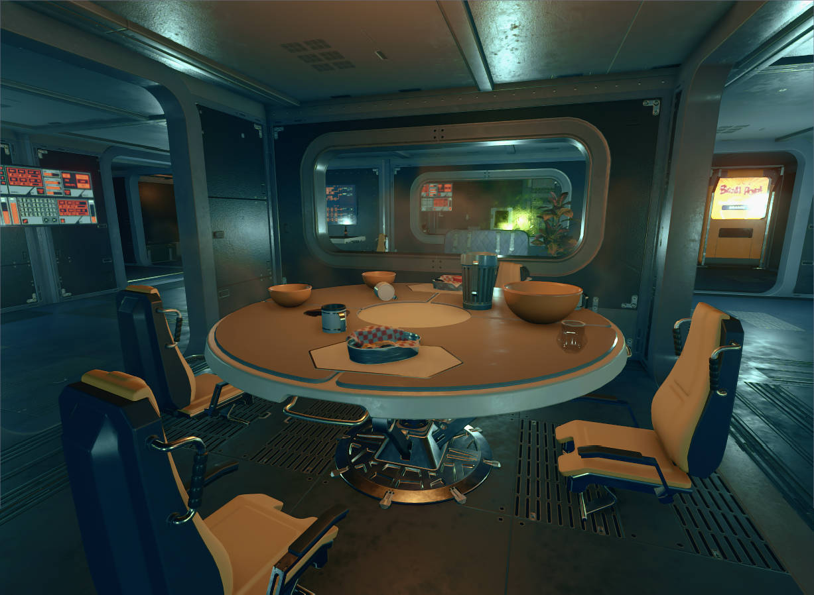
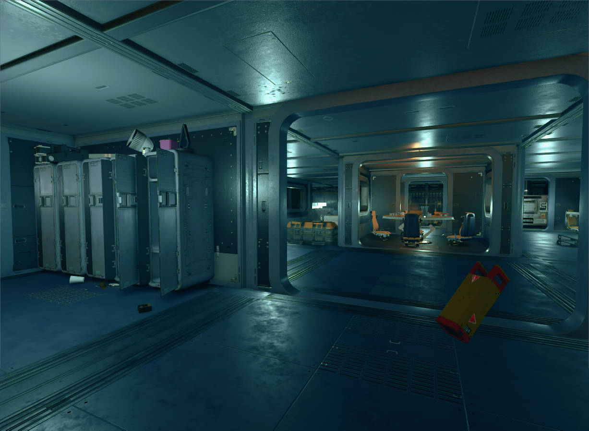
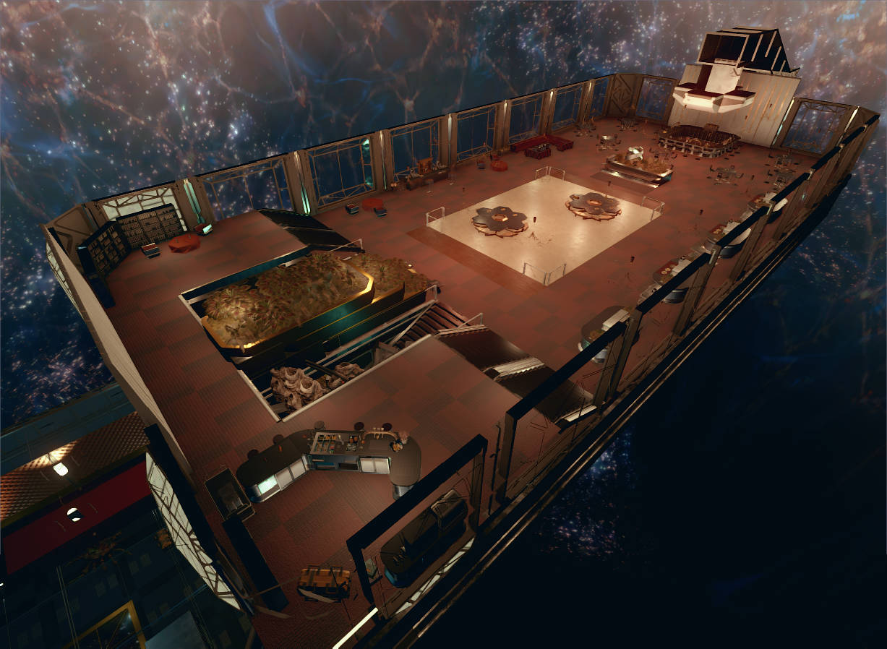
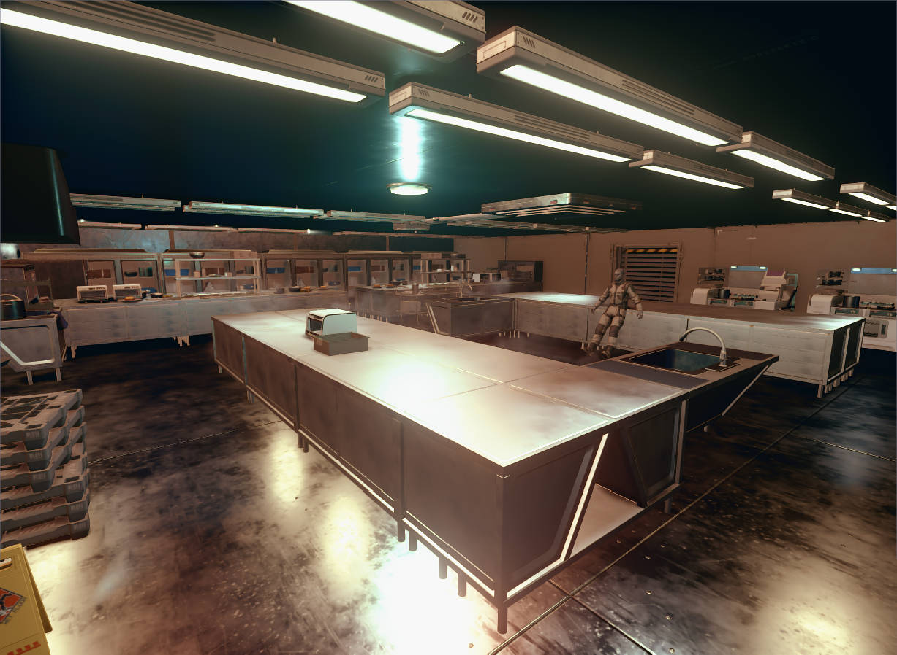
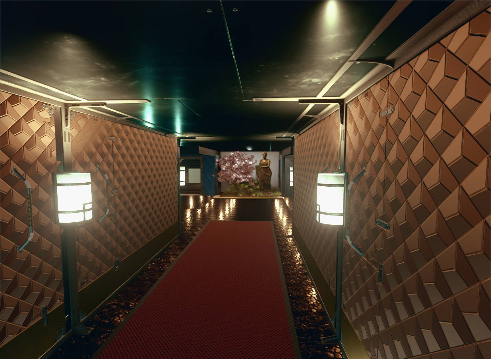
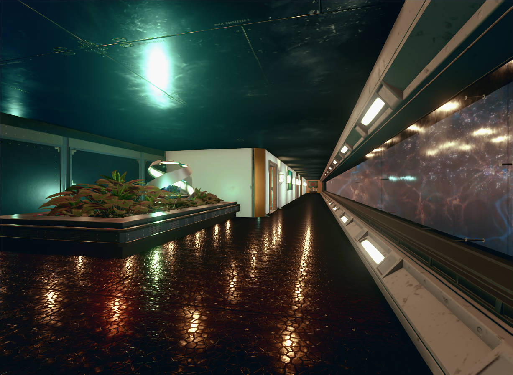
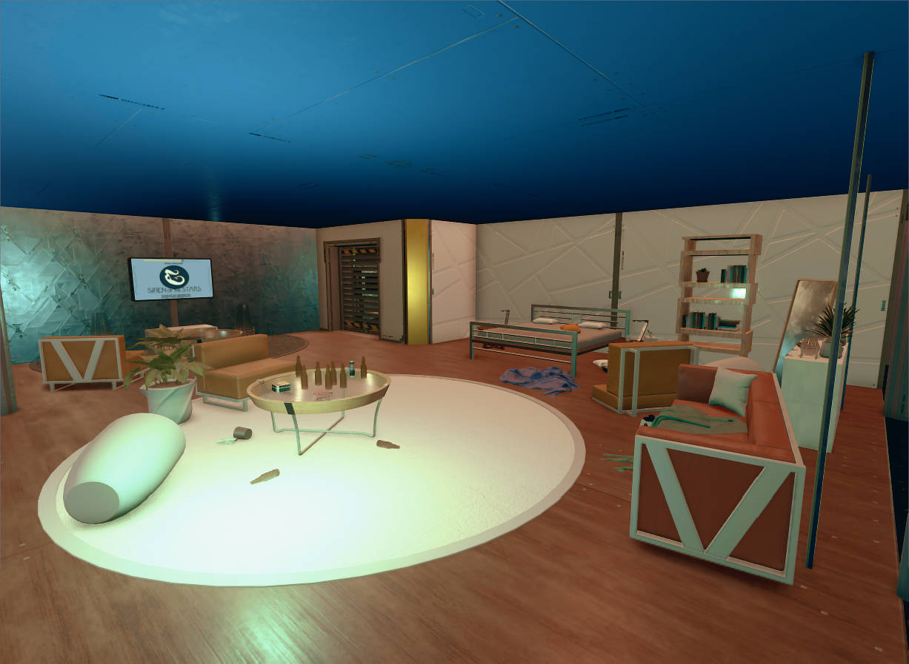
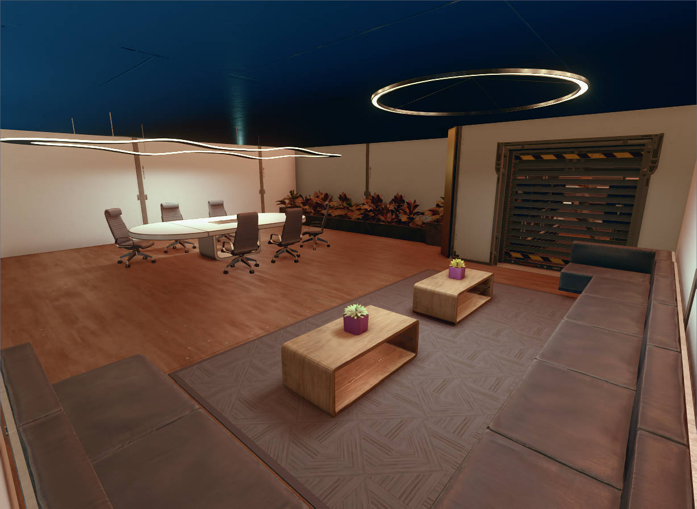

## One-Sentence Overview

A horror-exploration single-player quest level independently designed and developed in the Starfield Creation Kit, using environmental storytelling, multi-zone exploration, puzzles, and combat to create an immersive adventure aboard an abandoned luxury space liner.

## Game Overview

Starfield is an open-world science-fiction RPG developed by Bethesda Game Studios. Built with the official Creation Kit, this project adds an original, independently playable side quest to the game.

## Level Overview

Ghost Ship is a single-player side-quest level designed for Starfield. The player boards a missing luxury space liner to investigate a disappearance. During the exploration, the player gradually restores the ship's power, unlocks sealed areas, gathers key supplies, and uses environmental clues to uncover the truth behind the vessel's destruction, culminating in a final confrontation with an unknown creature in the cargo hold. The level combines exploration, combat, stealth, puzzles, and environmental storytelling to create a suspense-horror experience similar to Alien: Isolation.

## My Work

### 1. Overall Level Design (Level Layout & Progression)

Designed the complete level flow, connecting the bridge, passenger cabins, crew quarters, activity areas, cargo hold, and other functional zones into a coherent exploration route. Power restoration, key collection, battery puzzles, and related mechanics progressively unlock new areas and create an increasingly layered exploration rhythm.

### 2. Environmental Storytelling and Atmosphere Design

Built the world of an abandoned luxury space liner. The placement of bodies, terminal logs, scene details, lighting changes, and environmental damage allows players to gradually infer what happened while establishing an Alien-like suspense-horror atmosphere.

### 3. Exploration, Puzzle, and Combat Design (Gameplay Design)

Designed power-restoration tasks, key searches, battery collection, ventilation-shaft infiltration, secret rooms, and other exploration and puzzle mechanics. Xenogrubs, Terrormorphs, and other enemies make exploration, puzzle-solving, and combat alternate throughout the experience, steadily increasing tension.

### 4. Pacing Design

Built a complete experiential arc through a dark zero-gravity opening, power restoration, free exploration, confined pursuit sequences, resource management, and a final boss battle, gradually escalating from exploration to climactic combat.

## Timeline

Stage｜Date｜Work Completed
Level Design Pitch｜2026.05.26｜Completed the level pitch and established the theme, art direction, core gameplay, narrative framework, and overall level flow.
Level Design Document｜2026.06.01｜Completed the LDD and defined the spatial layout, exploration flow, puzzle mechanics, combat setup, and environmental storytelling design.
Whitebox｜2026.06.08｜Completed the whitebox and validated the spatial layout, player flow, exploration pacing, and navigation design.
Initial Gameplay｜2026.06.22｜Implemented the core gameplay, exploration, puzzles, combat, environmental storytelling, and quest flow, and began playtesting.
Gameplay Complete｜2026.07.06｜Completed all level content and continued refining flow, combat, horror atmosphere, and environmental storytelling based on test feedback.
Aesthetics｜2026.07.13｜Completed environment art, lighting, materials, and set dressing to strengthen the visual presentation and immersion of the ruined luxury liner.
RTM｜2026.07.19｜Completed bug fixing, final polish, and project delivery.

## Playtesting and Iteration

Issue｜Solution｜Result
Even in a horror level, having no weapon felt frustrating to players, especially within Starfield.｜Gave the player an electromagnetic weapon early in the level.｜The player can briefly stun enemies early in the experience. This provides a way to resist threats without allowing the player to kill them outright, preserving the sense of fear.
The crew area was too open and had poor circulation.｜Divided the area with a central conference table, a surrounding loop corridor, and separate rooms around the outer edge.｜Created a more complex looping structure and improved circulation.
The save point was located inside the final boss room, creating an endless death loop.｜Placed a safe room outside the final boss arena.｜Eliminated the risk of an unusable save.

## Project Retrospective

### What Went Well

• Created a space-liner level with strongly differentiated visual and functional areas.
• Created a distinctive horror-game experience.
• Successfully reused spaces and routes.

### Even Better If

• As a cruise liner, the level could be larger and structurally more complex.
• Add more environmental storytelling content.
• Adjust interior route dimensions to accommodate the movement paths of large creatures.
• Enlarge the boss arena and enrich the single-encounter combat experience.

### What I Learned

• Developed a practical approach for transforming real-world architecture into level design.

The key lessons were:

1. Gather real-world references: for example, the cruise-liner level used deck plans from the Disney Cruise Line website as a reference.
2. Simplify the structure appropriately: the level does not need to reproduce a real twenty-deck cruise ship.
3. Adapt dimensions for gameplay: room heights and corridor widths must suit character scale and camera style; for example, third-person cameras often require larger interior spaces.
4. Redesign circulation: real architecture prioritizes safety and pedestrian flow, while level design must also account for flow state, sightlines, and other gameplay needs.

## Appendix

