## 一句话简介

《Hamsterballin'》是一款 UE5 本地多人竞速游戏。在 42 人团队中负责最终赛道、索道捷径系统与镜头演出设计。

## 项目介绍

《Hamsterballin’》是一款本地多人竞速游戏，玩家操控可滚动弹跳的仓鼠球，在充满机关、捷径与立体地形的赛道中竞争。项目由 SMU Guildhall Team Game Project II 课程开发，42人团队历时12周完成，Steam商店页已公开。

## 我的工作

### 1. 最终关卡：扭蛋机星系（Gacha Galaxy）

我认为，一条优秀的竞速赛道，应当由一个个强烈的“记忆点”串联而成。例如马里奥赛车，玩家并不会记住每一个弯道，每一个细节，却会记住沙漠地图的流沙漩涡，海底地图的巨型鳗鱼。所以在设计赛道时，我会先设想好这样的“记忆点”，安排他们出场的节奏，并用普通路段将这些高潮体验自然连接起来。

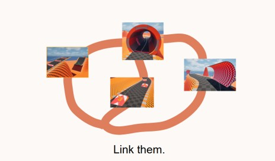

作为最终关卡主要负责人，我主导关卡的主题构思、赛道布局设计，以及与程序、美术团队的跨部门协作，推动关卡从概念设计到最终落地。

#### 1.1 确立关卡核心概念

项目进入关卡开发阶段后，我们需要在较短周期内完成一张完整赛道。于是我很快确立了我们的设计目标——一个巨大中心地标来作为本关卡的导航标识与记忆锚点。我提出了“赛道围绕巨大机器人”搭建的设想。

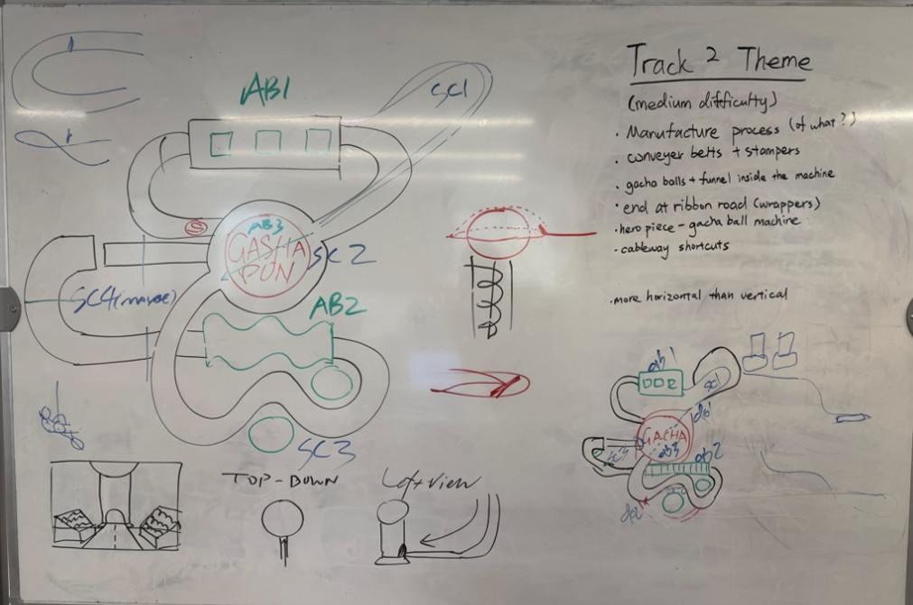

但是考虑到开发周期短与美术团队人手不足的情况，在与团队Leader讨论后，我们很快将方案调整为了扭蛋机，这一修改既保留了中心地标的设计理念，也显著降低了美术制作成本，最终形成了“围绕扭蛋机—穿越扭蛋机—进入扭蛋机内部返回起点”的整体空间结构。

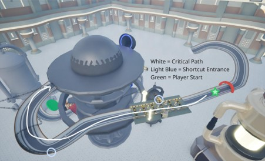

#### 1.2 主导核心区域设计

确定整体布局后，我负责赛道起点、终点，以及作为关卡核心的扭蛋机区域设计。

为了使赛道穿越扭蛋机，我们将扭蛋机上方球星部分套上“土星环”，这样一来，赛道在这里一分为二。关卡名“扭蛋机星系”也因此而来。

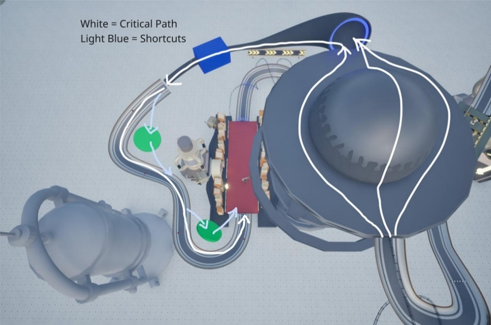

扭蛋机作为关卡主体，承担导航、视觉焦点和关卡主题表达等多重职责，我与美术团队进行了大量跨部门沟通，持续调整模型尺寸、风格、赛道连接方式与玩家视线，确保美术表现能够服务于玩家导航与竞速体验。

#### 1.3 推动核心玩法迭代

在多轮 Playtest 中，我们发现玩家进入扭蛋机内部后，需要连续通过三层螺旋管道返回高处。这一设计存在三个问题：
• 重复度高，缺乏操作空间。
• 玩家容易失去方向感。
• 长时间旋转造成部分玩家出现 3D 眩晕。

团队最初计划仅缩减为一层螺旋管道。我认为这一修改并未解决根本问题，因为玩家进入管道后几乎没有任何决策或操作，只是持续向前驾驶。

因此，我提出将整段路线改为索道（Cableway）系统。这一方案不仅彻底消除了重复路段，还创造了新的体验价值：
• 将高速竞速转换为短暂的观赏节奏。
• 近距离展示作为关卡核心的巨型扭蛋机，进一步强化玩家记忆点。

最终团队采纳该方案，并完成实现。

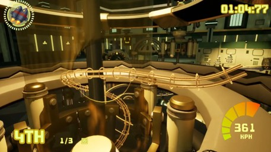

#### 1.4 项目成果

关卡顺利完成开发并随游戏上线，并成为整款游戏的最终关卡。

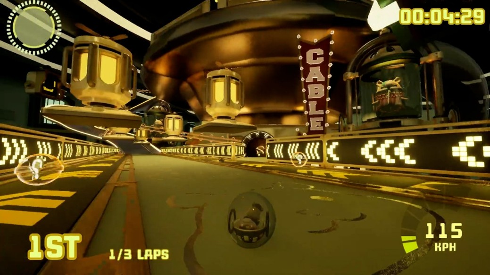

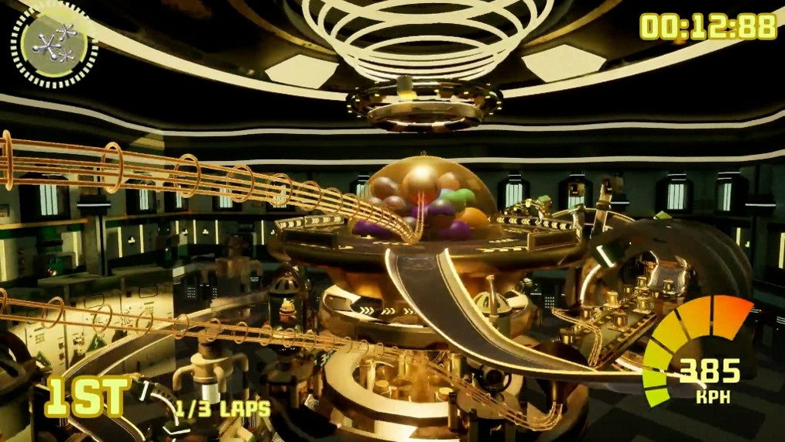

### 2. 索道系统及其镜头设计（Cableway System）

我从项目POCT阶段开始独立提出设想、设计并实现作为关卡捷径的索道系统，负责捷径规划、交互逻辑以及玩家的镜头演出。索道移动期间的镜头用于展示景观、预告后续路线和强化方向感，使该系统同时承担捷径、导航和演出功能。

早在POCT技术验证阶段，我便由《Balance》，《Splatoon》等游戏获得灵感，在早期的玩法探索中试图搭建这样的高速索道系统。但是由于我们的竞速游戏完全基于物理模拟，所以索道难以约束玩家，只能作罢。

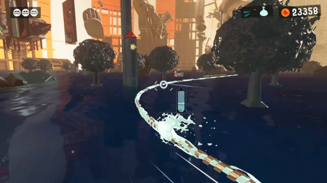

但是在POCG玩法验证阶段中，我仍然不愿放弃这个方向。在继续探索后发现可以由3到4根索道将玩家仓鼠球夹在其中，仅靠物理便完美约束玩家，并且有着很强的趣味性和演出潜力，自此，该玩法便确立为项目主要玩法之一，预期作为赛道捷径来使用。

在正式开发周期中，理所当然的，我负责与美术、程序组交流，继续开发索道系统。并且负责最终关卡中所有索道设计。我最引以为傲的索道是在赛道开始处，玩家即将通过扭蛋机上方“土星环”区域的索道，在这里，我将索道大幅延申出去，并且绕了一个反向的弯，形成优美弧度，让玩家先远离赛道，再高速切回中心。并使得摄像机大幅拉远、使用变焦镜头，让玩家感受疾速的同时欣赏以扭蛋机为中心的整个赛道。

在开发后期，我被要求优化所有关卡的所有的索道镜头，即使时间紧迫，团队表示如果你觉得任务过重可以拒绝，我依然接下这个任务。

不得不说，索道镜头背后的系统实际上十分简陋。在索道上，索道摄像机接管了玩家背后的第三人称相机，他始终遵循两条规则：
1. 方向始终朝向玩家。
2. 摄像机在摄像机轨道的运动百分比始终等于玩家在索道上的运动百分比。

这也导致了配置相机任务十分困难，没有任何精确控制能力，只能按照经验由人工手配。

我迅速安插到另外两组关卡设计团队中去，和他们沟通需求，磨合工作，最终完成了三个关卡总计11条索道镜头的配置与优化。

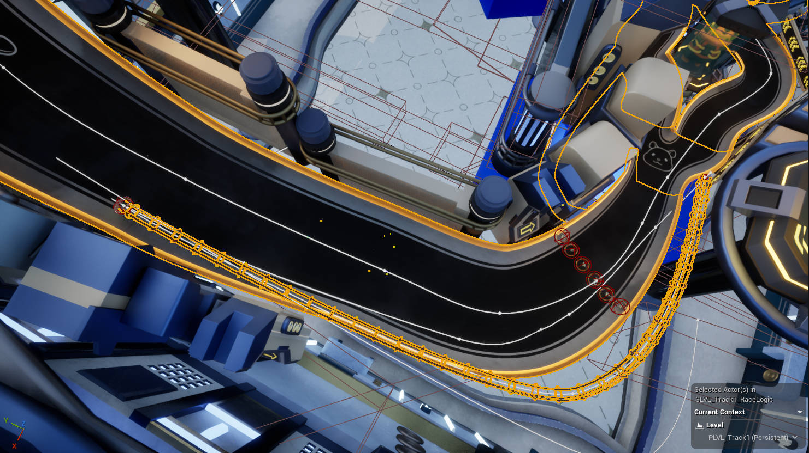

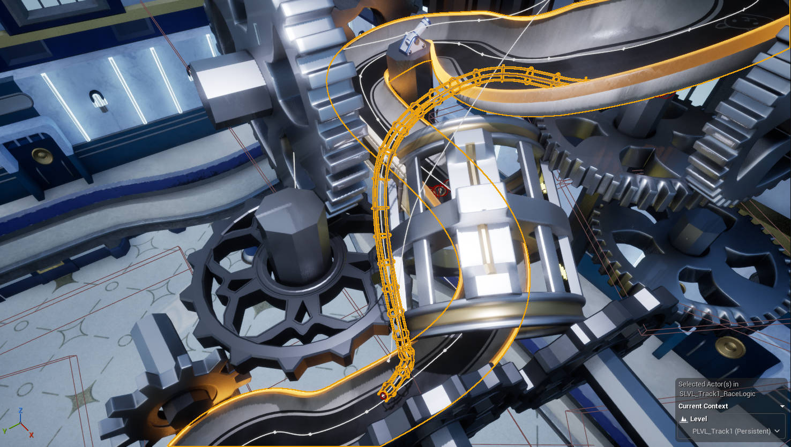

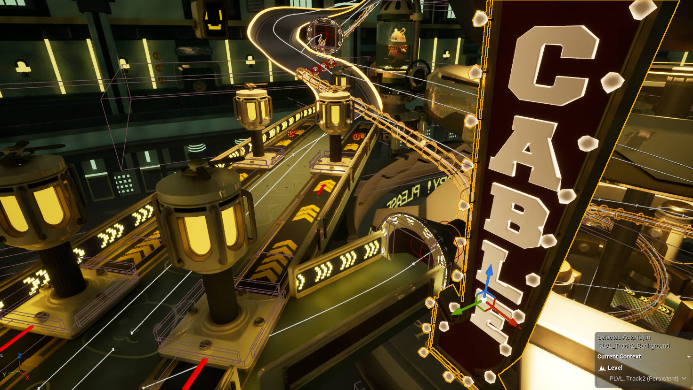

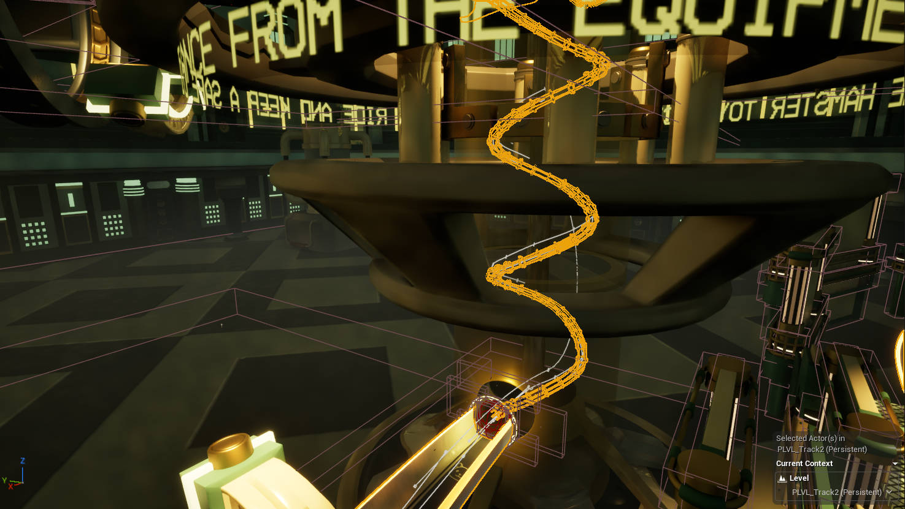

## 时间线

阶段｜时间｜工作内容
POCT｜2/20/2026｜探索索道早期玩法，曲折的道路。
POCG｜3/6/2026｜进一步探索索道系统，并有内容产出。
Prototype & Vertical Slice｜3/27/2026｜搭建试验关卡，学习使用PCG工具并且应用索道到赛道。
Alpha｜4/10/2026｜设计最终关卡并搭建。
Beta｜5/1/2026｜优化配置所有索道演出。
Launch｜5/10/2026｜最终测试，修复赛道PCG以及重生点。

## 测试迭代

问题｜迭代方案｜结果
扭蛋机内部管道过于重复，旋转导致3D眩晕｜使用索道代替｜独特螺旋演出效果，消除玩家迷失方向、毫无操作的部分，消除3D眩晕。
最终赛道结尾部分过短导致玩家在最后很难反超，比赛在最后没有悬念｜适当延长，并且使用大U型弯道，让技巧型玩家可以使用完成空中反超｜为结尾段创造捷径，添加竞技性与刺激感。
演出镜头多条反馈｜持续磨合修改｜完成三个关卡总计11条索道镜头的配置与优化

## 项目总结

项目亮点（What Went Well）
• 完成最终关卡「扭蛋机星系」的设计、制作与迭代。
• 完成全部索道镜头配置，提升了高速移动过程中的导航与演出效果。
• 与程序、美术及设计团队高效协作，项目最终顺利上线 Steam。

优化方向（Even Better If）
• 索道的镜头系统过于简陋，实际上我应该继续跟进程序团队，在这方面提更多需求来完善这一重要系统。如此可以避免陷入只能人工慢慢手调的情况。
• 部分捷径路线在早期版本存在风险与收益不平衡的问题，尤其是一些索道为了演出效果牺牲长度，需要多轮 Playtest 调整。
• 高速竞速下部分镜头切换影响玩家对前方路线的观察，需要不断优化镜头角度与时机。
• 由于多人竞速玩法高度依赖玩家行为，部分设计问题仅能通过大量多人测试发现。
• 更早开展多人 Playtest，在灰盒阶段验证路线设计。
• 丰富最终圈的动态事件与视觉反馈，使用不同演出，进一步强化终局高潮体验潮。

项目收获（What I Learned）
• 总结赛车项目流线经验
• 总结演出经验
• 总结关卡设计哲学
• 测试与迭代
• 大型团队跨部门协作管线

## 附件

• 无
