## One-Sentence Overview

A 2D platformer centered on fishing-rod swinging and precision input. I was responsible for the core gameplay and most of the level design, rescued the prototype by redefining its core mechanic, and created a complete difficulty curve from tutorial to high-level challenges.

## Project Overview

FLING is a 2D platformer centered on precision input. The player controls a fox who uses a fishing rod to swing, grab, and reposition while overcoming increasingly difficult platforming challenges in a dark and mysterious cave.

@[youtube](https://youtu.be/l4qM7wSsPoo "FLING Gameplay Showcase")

## My Work

### 1. Game Design

This was a project beset by challenges from the moment it began.

During our initial brainstorming, we proposed a game in which the player would use a fishing rod as a grappling hook for platforming, combat, fishing, and other actions while exploring a Metroidvania-like world. This closely matched my design philosophy of “extending an entire design from one simple, interesting mechanic.”

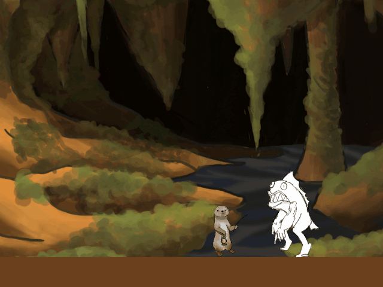

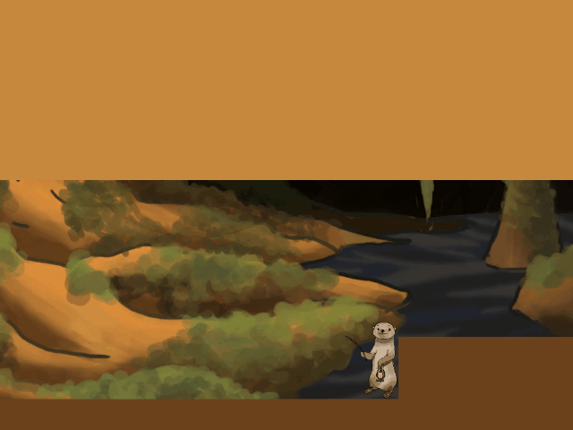

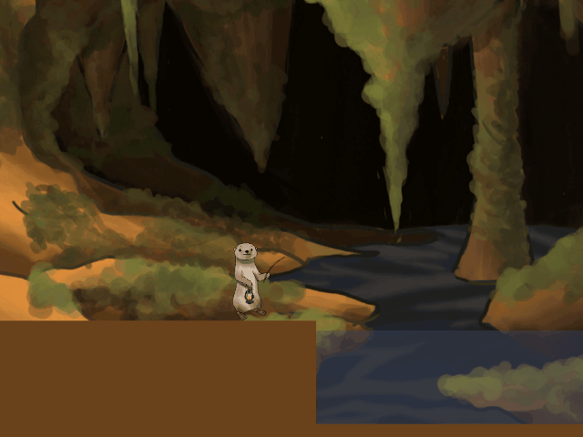

After considering the development schedule, however, we decided to focus entirely on platforming and adopt a linear structure similar to Celeste.

Our prototype was then largely established. Early testing, however, showed that pure grappling-hook platforming demanded excessive precision, making the overall experience frustrating rather than fun. The dean expressed disappointment after testing it. The project was close to cancellation, and the team was also facing reorganization.

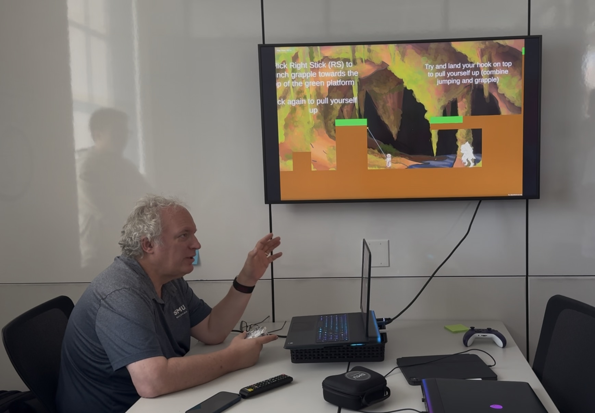

That weekend, I played Super Mario World 2: Yoshi's Island, a 1992 GBA game, on a retro handheld. In it, Yoshi could throw eggs in any direction across a 2D plane. But how could such a complex action be performed on an old handheld with only a directional pad and A and B buttons—not even an analog stick? The game's solution was that after the throw button was pressed, every obstacle and enemy in the level stopped moving. Time resumed only after the player slowly selected a direction with the aiming reticle and threw the egg.

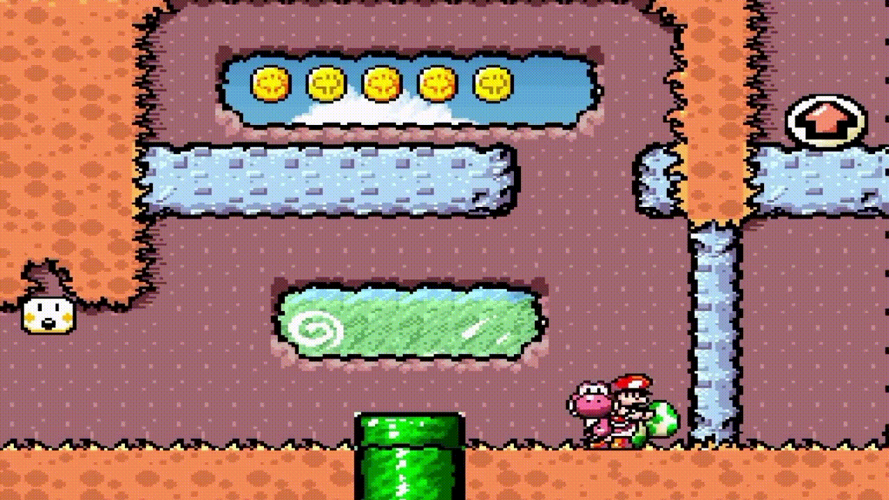

This gave me a solution to our project's problem. At the beginning of the next week, I proposed a “time-stop” mechanic. When the player is airborne and uses the right stick to fire the grappling hook, time stops, giving the player enough time to aim precisely. When the right stick is released, the hook fires and time resumes. The programmer implemented this simple mechanic in only one minute, but that small change completely transformed the game. It resolved the excessive precision requirement, gave players more room and tolerance to act, improved the game's rhythm through the pull-and-release cadence of throwing the hook, and added strategic and mechanical depth. It became the project's core mechanic. This is similar to the time slowdown triggered when Link fires an arrow in midair in The Legend of Zelda: Breath of the Wild.

### 2. Level Design

The project uses seamless level design similar to Celeste. It contained 16 level rooms in total, with Rooms 4 and 10 removed from the final version.

I designed most of the levels: Rooms 1 through 8, Room 12, and Rooms 14 through 16. These covered the tutorial, progression, and high-difficulty challenge stages. I focused especially on difficult levels near the end of the game while maintaining the overall difficulty curve. Throughout development, I also restructured, cut, and repaced levels based on feedback from multiple rounds of public playtesting.

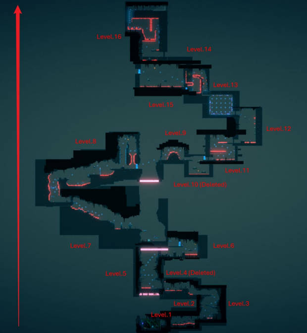

(Before continuing, I need to introduce an important game mechanic: the “bubble.” Stepping on a bubble applies upward force to the player for jumping. Grappling a bubble launches the player in the direction of the grapple. After use, the bubble disappears and respawns after a short delay.)

The level I am most satisfied with is Room 16, the final level. I began with two goals:
1. Include every mechanic in the game.
2. At the end of a difficult level—and at the end of the entire game—release all of the pressure accumulated throughout the experience.

I achieved both goals well. For the first, I linked all of the game's mechanics together and recombined them into a new level. At the very end, I used the game's “bubble” obstacle in an unconventional way that broke the player's established assumptions and created one final surprise. For the second, I placed a chain of bubbles at the end, repeatedly launching the player toward the surface to create an exhilarating experience and provide emotional release.

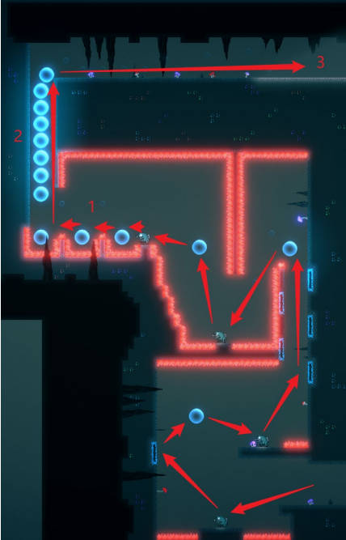

(Before continuing, I also need to introduce another important mechanic: the “bouncing monster.” The monster moves back and forth on its own. When the player grapples it, the player first flies toward it, then bounces upward by landing on its head.)

Room 12 is set in a tall vertical chamber. In an early version, I drew inspiration from Celeste and created two upward routes: a spike route on the left and a route using launching “bubbles” on the right. Extensive testing showed that the split did not make the level richer; instead, it shortened the room, and players almost always chose the easier, friendlier bubble route. The room therefore needed to be redesigned.

After several iterations, my own skill as a player continued to improve, and I eventually discovered a special maneuver. Because of the game's physics, the player can still make small adjustments to their falling direction while airborne, even against the direction of the initial jump or grappling dash. I decided to design the level around this advanced technique.

Based on this mechanic, I designed a sequence in which the player grapples a “bouncing monster” and dashes to the right, but a death hazard is placed on that side. Immediately after the dash, the player must reverse direction and jump left. The sequence repeats several times. Repeated playtesting showed that some players could not immediately understand this unusual technique and died many times. Across the three repetitions, I therefore replaced the death hazard in the first layer with a normal, harmless obstacle, giving players a consequence-free opportunity to experiment. Most players could then infer the level's intent through repeated low-cost attempts, learn the advanced technique, and complete the room.

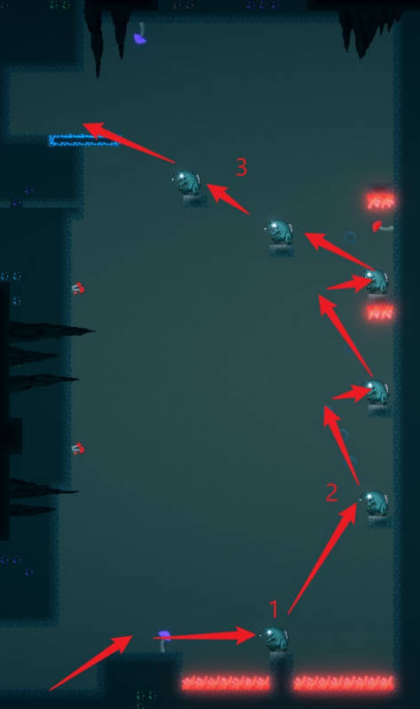

## Timeline

Stage｜Date｜Work
POCT｜10/4/2026｜Brainstormed the project direction and presented it publicly.
POCG｜10/11/2026｜Completed a game demo in which players could move with the fishing rod, attack enemies, and fish.
Prototype & Vertical Slice｜10/24/2026｜Designed levels based on the POCG, but poor playtest feedback left the project at an impasse.
Alpha｜11/7/2026｜Developed the “time-stop” solution and rescued the game.
Beta｜11/21/2026｜Continued developing levels and opened the project to public playtesting.
Launch｜11/3/2025｜Conducted final testing.

## Playtesting and Iteration

Problem｜Iteration｜Result
Local spikes in the difficulty curve｜Reordered rooms, removed two redundant levels, and added transitions between mechanics｜Players found the overall difficulty progression natural, with only the final level remaining highly challenging.
New mechanics had a high learning cost｜Rebuilt tutorial levels, teaching complex mechanics in separate steps before combining them｜Players could generally master every core mechanic independently, with only a few requiring additional guidance.
The ending felt incomplete｜Redesigned the final level to summarize the mechanics and provide emotional release｜The final level became the game's climax and gave players a complete closing experience.

## Project Retrospective

What Went Well
• Redefined the core gameplay and successfully rescued the prototype. Reframed the grappling mechanic, which originally demanded extremely precise input, into the core action of “launching yourself,” greatly improving both enjoyment and controllability.
• Built a complete difficulty curve. Created a gradual learning experience from foundational teaching through mechanic combinations to the final challenge, and continuously refined the pacing through multiple playtests.
• Created a memorable final level. The final level not only integrates every game mechanic but also uses emotional-release design to give players a complete and rewarding conclusion.

Even Better If
• Test with players earlier. More feedback from real players during the prototype phase could have exposed core-gameplay problems sooner and reduced the cost of large late-stage revisions.
• Add more levels that bridge mechanics. Some mechanics still have significant learning gaps between them. Further breaking down the player's skill progression could make the difficulty curve smoother.
• Continue expanding level variety. Introduce more combinations of obstacles and situations while preserving the consistency of the core mechanic, further improving freshness.

What I Learned
• Playtesting is more important than design assumptions. Player feedback reveals real problems more effectively than a designer's own judgment, and great levels emerge through constant iteration.
• A final level carries more than difficulty. It should summarize the game's mechanics, validate the player's growth, and deliver emotional closure and release.
• Level design serves the player experience. What players truly remember is not one obstacle, but the complete experience created by challenge, growth, and emotional change.

## Attachments

[View the FLING Game Design Document (PDF)](pdfs/fling_gdd.pdf)
[View the FLING ReadMe (PDF)](pdfs/GroundZero_FLING_Readme.pdf)

Team Photos:

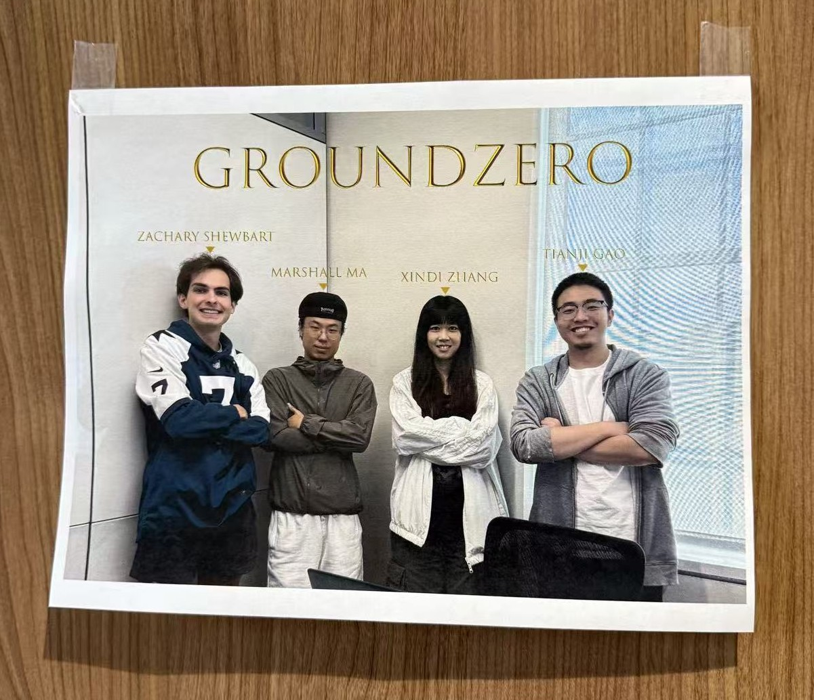

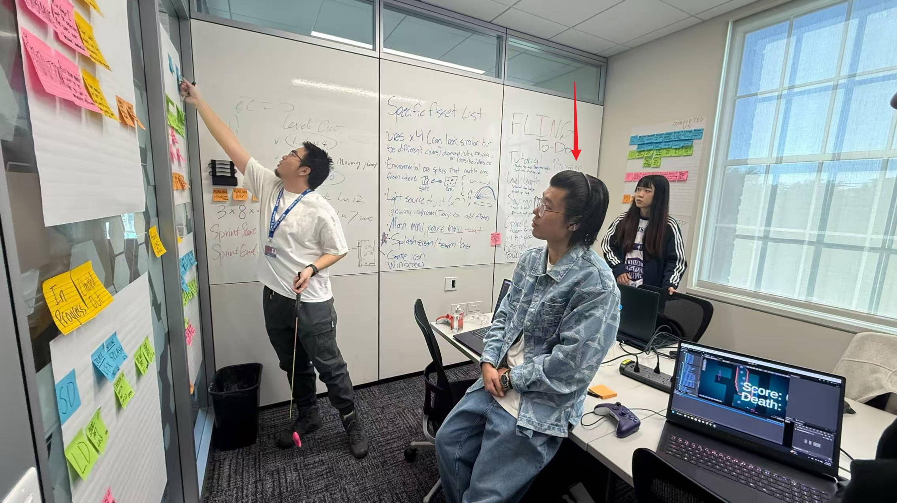

Level Images:

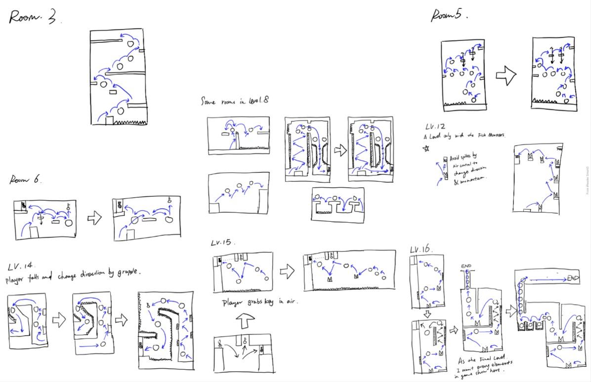

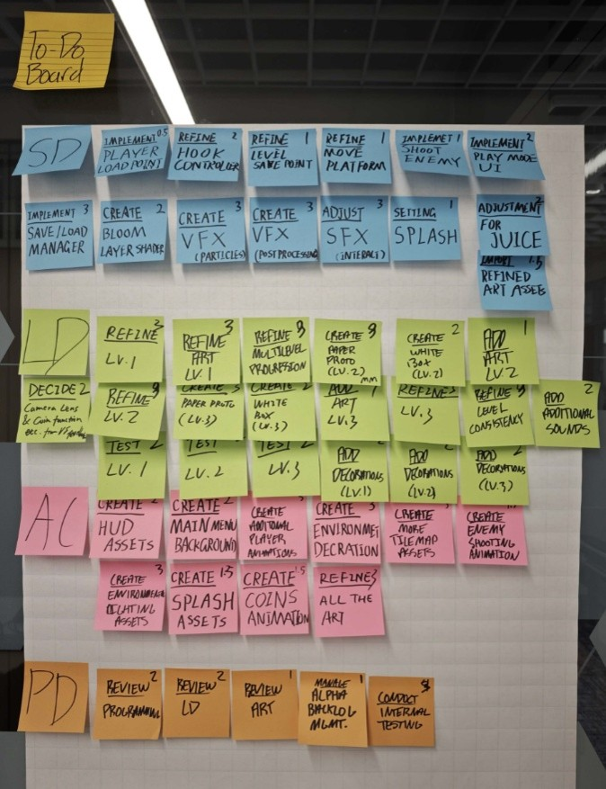
